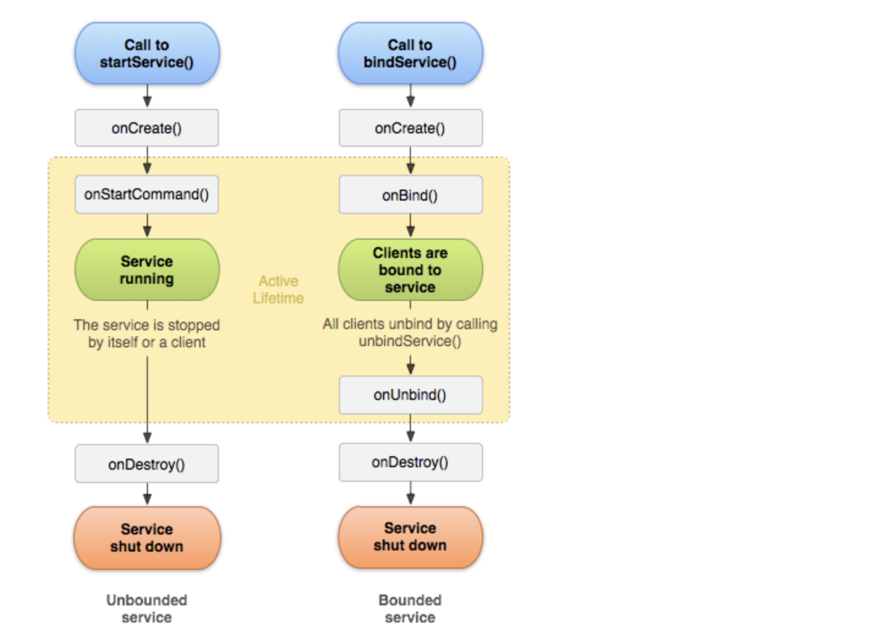
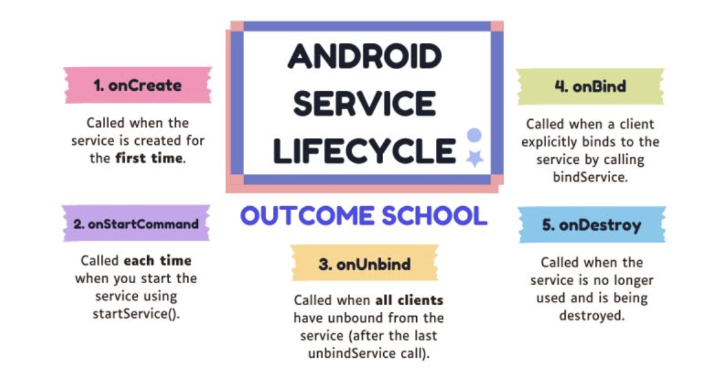

#  Services
- Services are background tasks that run without a user interface, and they are used for long-running tasks like music playback, file downloads, etc
- Types of Services:
  1. Foreground Service
  2. Background Service
  3. Bound Service

1.Foreground Service Overview 
--
- Foreground Service perform some operations that are noticeable to the user.The services continue running even when the user isn't interacting with the app. 
- It must display a notification, to make users aware that your app is performing a task in the foreground.
  This notification cannot be dismissed unless the service is either stopped or removed from the foreground.

    1. Declare foreground services and request permissions on AndroidManifest
       - android:foregroundServiceType attribute - declares what kind of work the service does
       - If multiple types apply to your service, separate them with the | operator. For example, if your service uses the camera and microphone, declare it like this:
         `android:foregroundServiceType="camera|microphone"`
     2. Create a MusicPlayerService - 
        - Initialize a MediaPlayer instance - help implements MediaPlayer operations such as play(),next(),pause(),prev() etc.
        - Use MediaSessionCompact to enable media controls thru notifications
        - Notification - use Foreground service to keep the app running when the user is interacting with other apps.(Display the notification with controls for play, pause, and skip)
        - Binder Class - that will expose the service methods to the client bound to this service
     3. Bind Service to the client(Activity) - 
        - Bind the MusicPlayerService to your activity using bindService() and ServiceConnection.
        - Use IBinder on ServiceConnection callback fun to interact with the service and control the music player from the activity.

Why Use a Foreground Service for Music Playback?
--
- When you build a music player app that needs to continue playing music while the user switches to another app or locks the screen, 
  it is vital to use a foreground service. 
- This is because Android’s battery optimization mechanisms tend to stop background services (especially in Android 8.0 and later), 
   which could result in your app stopping the music unexpectedly.

#2. Bound Service
---
- A service is bound when an application component binds to it by calling bindService()
- A bound service offers a client-server interface that allows components to interact with the service, send requests, receive results, and perform interprocess communication (IPC). 
- A bound service runs only as long as another application component is bound to it.

#3. Background Service

ref: https://developer.android.com/develop/background-work/services - services

# Intent
- Intent is a messaging object that allows you to request an action from another application component (such as an Activity, Service, or BroadcastReceiver).
- An Intent can be used to:
   Start an activity.
   Start a service.
   Deliver a broadcast message.
- Types of Intents in Android
   1. Explicit Intents: These specify the exact component (Activity, Service, or BroadcastReceiver) to perform the action. 
      You use explicit intents when you know exactly which component you want to interact with.
  2. Implicit Intents: These don't specify a particular component. Instead, they declare a general action and let the system find the appropriate 
     component (Activity, Service, or BroadcastReceiver) to handle it. For example, viewing a webpage 
     `Intent(Intent.ACTION_VIEW, Uri.parse("https://www.google.com"))`
  3. What happens when we start a component and pass the intent? in our case when we `startService(intent)`
  
     `This will start the MusicPlayerService and send the intent to it. 
     The service will receive the intent in its onStartCommand() or onBind(), and it can then use the information in the intent 
     (such as the action or extra data) to determine what action to perform.`

PendingIntent
--
- A PendingIntent is an Intent wrapper that allows you to execute the action later or in another context 
  (such as when the user interacts with a notification or when an alarm goes off).
- The PendingIntent takes your original Intent and wraps it, so when it's triggered, it can execute that intent.

  - How Does PendingIntent Work?

     1. A PendingIntent is created with a reference to a specific Intent and the action to be performed. 
      It then delegates the execution of that action to a third party, typically the system or another app. Here's the general idea:
     2. Create the Intent: The Intent contains the specific action to perform.
     3. Create a PendingIntent: This wraps the Intent and gives permission for someone else (system, other apps) to execute the action in the future.
     4. Use the PendingIntent: You pass the PendingIntent to components like NotificationManager, AlarmManager, etc., which will execute the action when the time comes.